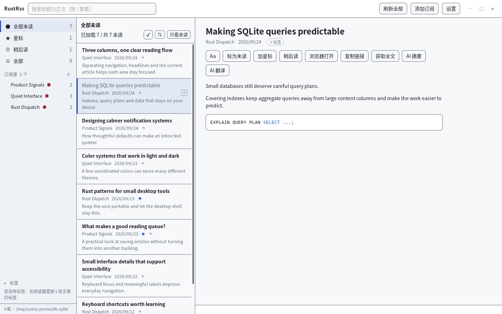
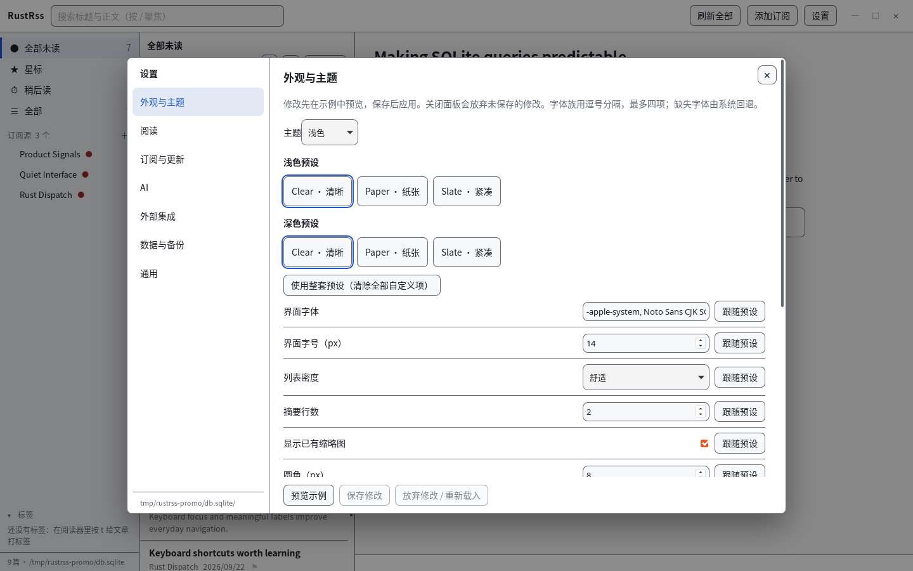

# RustRss

**把 RSS 阅读带回桌面。** 一个本地优先的跨平台阅读器：订阅和阅读状态留在自己的设备上；需要时，可选用自带密钥的 AI，或通过 MCP 把订阅接入你的 agent 工作流。

Rust + Tauri 2 · SQLite · RSS / Atom / JSON Feed



界面截图使用虚构演示内容生成。

## 阅读体验

- **专注阅读**：订阅、文章列表和正文分栏展示；支持搜索、稍后读、星标、标签和键盘操作。
- **数据在本地**：订阅、文章与阅读状态存入 SQLite；无需账号或云同步。
- **AI 由你选择**：配置自己的 OpenAI 兼容、Anthropic、Gemini 或 Ollama 服务，用于文章摘要和翻译。
- **面向 agent 的 MCP**：让兼容客户端读取你的订阅和文章。服务只监听回环地址，默认只读，写能力需单独授权。



## 开始使用

```bash
cargo run -p rustrss-desktop
```

RustRss 面向 Linux、Windows 和 macOS 桌面。已发布的安装包和版本说明以 [GitHub Releases](https://github.com/expoli/RustRss/releases) 页面为准；也可以查看[快速开始](docs/getting-started.md)从源码运行。

## 文档

| 指南 | 内容 |
| --- | --- |
| [快速开始](docs/getting-started.md) | 环境准备、运行应用、首次订阅 |
| [功能介绍](docs/features.md) | 阅读、搜索、快捷键、外观和订阅管理 |
| [内置 AI](docs/ai.md) | 服务商配置、密钥存储和文章处理 |
| [MCP 集成](docs/mcp.md) | 连接客户端、工具范围与读写权限 |
| [隐私与数据](docs/privacy.md) | 本地数据、外部请求和安全边界 |
| [开发指南](docs/development.md) | 项目结构、构建、日志和发布 |
| [全部文档](docs/README.md) | 按读者角色浏览指南与项目资料 |

## 隐私概览

文章库和阅读状态保存在本机。AI 请求会把所选文章内容发送到你配置的服务商；MCP 可让你授权的本地客户端读取订阅。开启文章缩略图时，WebView 会直接请求图片站点。详见[隐私与数据](docs/privacy.md)。

## 许可证

[MIT](LICENSE-MIT) OR [Apache-2.0](LICENSE-APACHE)
