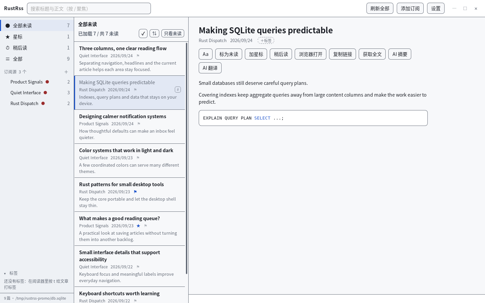
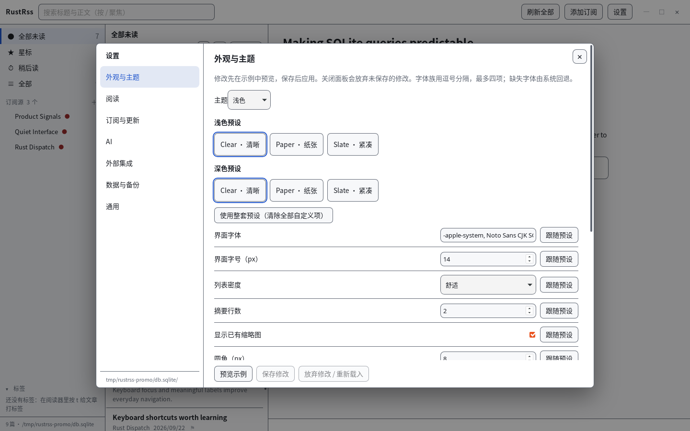

# RustRss

**把 RSS 阅读带回桌面。** 一个本地优先的跨平台阅读器：订阅和阅读状态留在自己的设备上；需要时，可选用自带密钥的 AI，或通过 MCP 把订阅接入你的 agent 工作流。

Rust + Tauri 2 · SQLite · RSS / Atom / JSON Feed



界面截图使用虚构演示内容生成。

## 阅读体验

- **专注阅读**：订阅、文章列表和正文分栏展示；支持搜索、稍后读、星标、标签和键盘操作。
- **数据在本地**：订阅、文章与阅读状态存入 SQLite；无需账号或云同步。
- **AI 由你选择**：配置自己的 OpenAI 兼容、Anthropic、Gemini 或 Ollama 服务，用于文章摘要和翻译。
- **面向 agent 的 MCP**：让兼容客户端读取你的订阅和文章。服务只监听回环地址，默认只读，写能力需单独授权。



## 开始使用

```bash
cargo run -p rustrss-desktop
```

RustRss 面向 Linux、Windows 和 macOS 桌面；Android 版可在设备上侧载使用——订阅、刷新、离线阅读、AI 摘要/翻译（四家提供商）、外链打开与安全密钥存储均已在模拟器/设备上验证，构建/签名/安装步骤见 [docs/development.md](docs/development.md) 的 Android 段，持续构建由 Android CI（`android-build.yml`）承担。已发布的安装包和版本说明以 [GitHub Releases](https://github.com/expoli/RustRss/releases) 页面为准；也可以查看[快速开始](docs/getting-started.md)从源码运行。

Windows 主题预览截图现通过 WebView2 的原生内容截图接口生成 PNG，并沿用 MCP 预览的修订号、像素标记、文件配额与到期规则。该适配器的 Windows 真机运行验收仍在进行中；当前不能把 Linux 截图结果当作 Windows 场景、缩放和最小化的通过证据。复验范围见 [Windows 预览验收记录](.chorus/specs/rss-reader/2026-09-23-theme-preview/windows-capture.md)。
macOS 主题预览现使用 WKWebView 内容截图适配器；真实 macOS 会话的三场景、缩放与失败路径仍待运行验收，步骤和证据状态见 [macOS 截图记录](.chorus/specs/rss-reader/2026-09-23-theme-preview/macos-native-capture.md)。

Linux 上的最终整合版已在隔离的 KWin Wayland 和 Openbox X11 会话通过场景级预览回归，并完成一次 agent 实际读图、调整、保存和取消后的 SQLite 回读；[运行证据](.chorus/specs/rss-reader/2026-09-23-theme-preview/agent-loop-2026-09-28/README.md)附原始 PNG 与二进制指纹。Windows/macOS 真机环境本次不可用，按用户指示跳过相应运行测试；两平台的原生截图与失败路径仍标为待验。

## 发布步骤

版本变更和已知限制见 [CHANGELOG.md](CHANGELOG.md)。

1. 在根 `Cargo.toml` 的 `[workspace.package]` 和 `src-tauri/tauri.conf.json` 中同步更新版本号，提交版本变更。
2. 更新 `CHANGELOG.md`，记录该版本变更和已知限制并提交。正式 Release 说明由工作流自动生成，发布时核对并补充 CHANGELOG 中的内容。
3. 将上述提交推送到 `master`，再创建并推送与版本号一致的 `vX.Y.Z` tag。`release.yml` 会校验 tag 与两处版本号，构建 Linux `.deb`、Windows NSIS `.exe`、macOS arm64 `.dmg`，并创建 GitHub Release；macOS 包目前未签名。
4. 从 tag 对应的产品源码，沿用项目发布密钥构建 Android ARM64 / x86_64 通用 release APK，检查版本、签名和安装升级后上传到同一 Release。命令与密钥配置见 [Android 发布步骤](docs/development.md#android)；`android-build.yml` 的 debug APK 仅用于持续构建检查，不会自动成为 Release 附件。
5. 从正式附件记录各安装包字节数与 SHA-256，回填 `.chorus/specs/rss-reader/spec.md` 的「安装包体积实测值」条目和 `docs/releases/` 的发布记录。

只需测量体积时，在 GitHub Actions 手动触发 `release.yml`（`workflow_dispatch`）：它构建并上传三平台产物，但不创建 Release；无需为测量打 `v*` tag。

## 文档

| 指南 | 内容 |
| --- | --- |
| [快速开始](docs/getting-started.md) | 环境准备、运行应用、首次订阅 |
| [功能介绍](docs/features.md) | 阅读、搜索、快捷键、外观和订阅管理 |
| [内置 AI](docs/ai.md) | 服务商配置、密钥存储和文章处理 |
| [MCP 集成](docs/mcp.md) | 连接客户端、工具范围与读写权限 |
| [隐私与数据](docs/privacy.md) | 本地数据、外部请求和安全边界 |
| [开发指南](docs/development.md) | 项目结构、构建、日志和发布 |
| [全部文档](docs/README.md) | 按读者角色浏览指南与项目资料 |

## 隐私概览

文章库和阅读状态保存在本机。AI 请求会把所选文章内容发送到你配置的服务商；MCP 可让你授权的本地客户端读取订阅。开启文章缩略图时，WebView 会直接请求图片站点。详见[隐私与数据](docs/privacy.md)。

## 许可证

[AGPL-3.0-or-later](LICENSE)：任何人可自由使用、修改、分发，**包括商业用途**；附加的唯一约束是源码开放义务（第 4、5、13 条）。因此若你修改 RustRss 并以网络服务形式对外提供，需向使用者提供完整的对应源码（本仓库即为对应源码）。

**需要闭源分发、把修改版作为商业产品出货，或不愿承担源码开放义务**时，请另行取得[商业授权](LICENSE-COMMERCIAL.md)。

- 历史版本（提交 `cfaf0dc` 及更早，含切换前的 `nightly` 安装包）仍按 MIT OR Apache-2.0 授权，其授权不可撤销，文本见 [`LICENSES/`](LICENSES/README.md)。
- 版权许可不授予商标权，修改版分发请遵守[商标政策](TRADEMARK.md)。
- 贡献代码前请阅读[贡献指南](CONTRIBUTING.md) 中的贡献授权条款。
